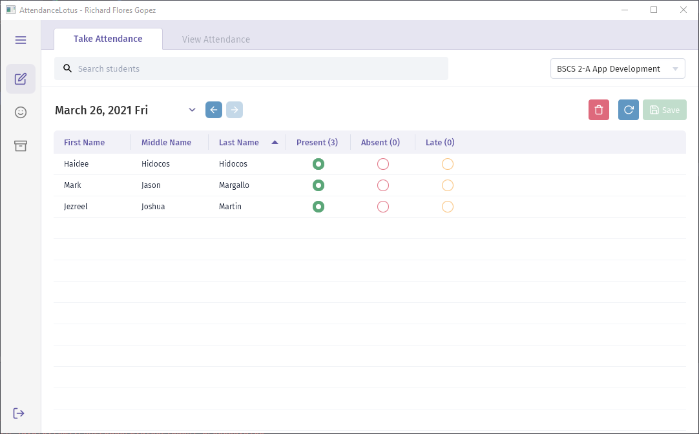
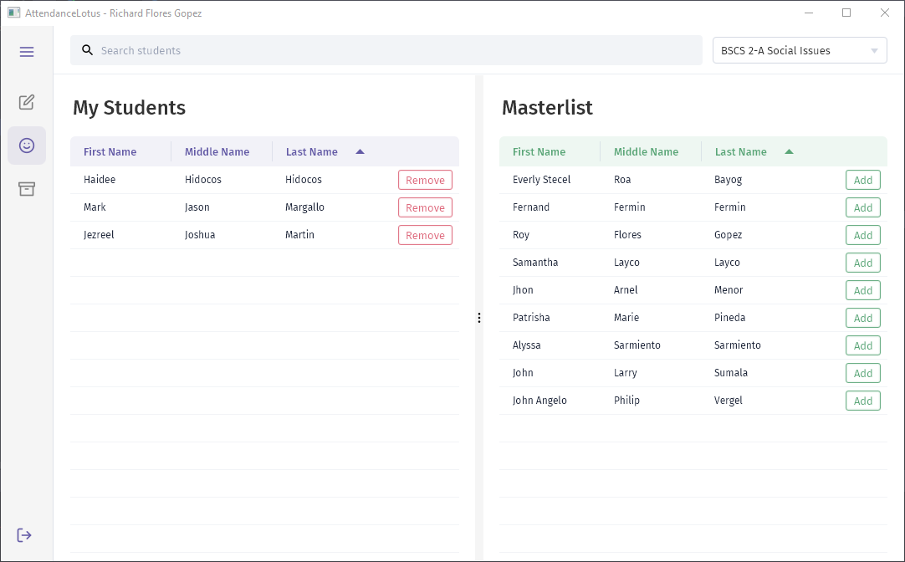

# AttendanceLotus
AttendanceLotus is an attendance system capable of taking attendance with multiple classes.
## Features
- Simple UI
- Search students or teachers
#### Admin
- Add students and teachers
- Add courses, classes, and subjects

#### Teacher
- Take attendance
- View attendance
- Add students to classes
- Add classes

## Setup
1. Start MySQL and Apache in XAMPP
2. Open <https://localhost/phpmyadmin>
3. Create new database named `attendancelotus`
4. Click **Import**
5. Locate `AttendanceLotus/db/attendanceLotus.sql` then **Click File** or drag it to the window 
## Usage
#### Admin
- `username:` admin
- `password:` admin
#### Teacher
You can check on **Admin > Teachers**

**All lowercase**

First name initial + Middle initial + Last name + number

Example: Richard Flores Gopez
- `username:` rfgopez1
- `password:` 1234
